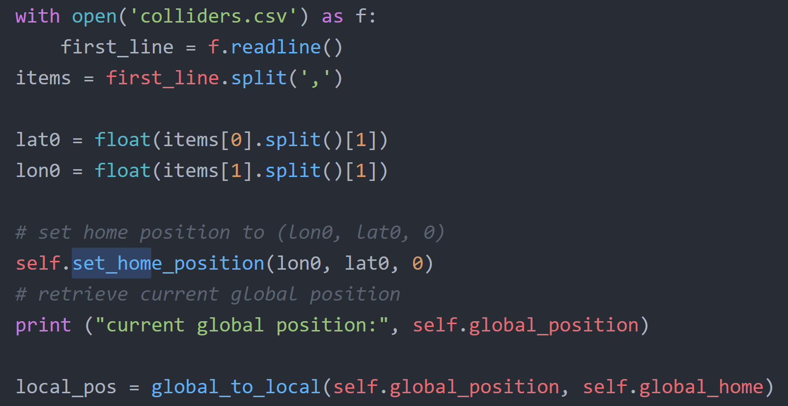
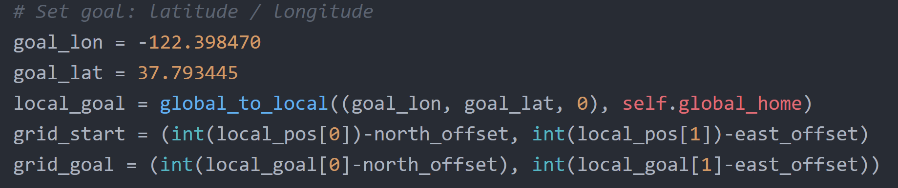

# Project: 3D Motion Planning

---
## Starter Code Explanations
1. 'MotionPlanning' is called in __main__. Several callback functions are defined here. The main event cycle is as follows. MANUAL->ARMING->PLANNING->TAKEOFF->WAYPOINT->LANDING->DISARMING->MANUAL
2. After ARMING event, 'plan_path()' is called to calculate waypoints for flying from start to goal.
3. In 'plan_path()', first current event is set to PLANNING. A 2.5D grid map is loaded by calling create_grid(). The start is set to the center of the grid map and the goal is set to about 14 meters Northern-east direction from the center. Then 'a_star' is called to calculate the waypoints.
4. In 'a_star()', all possible paths are calculated and the one with lowest cost will be returned as target waypoints for flying.
5. When received waypoints, event goes from PLANNING to TAKEOFF then to WAYPOINT, flying from the first waypoint, one by another, to the last waypoint.
6. After reaching the last waypoint, the event goes to LANDING and the drone begins to land. When the altitude is close to the ground, the event finally changes to DISARMING->MANUAL.

---
## My implementation
### 1. Set global home position
First read the first line of 'colliders.csv' which contains the latitude and longitude of the map center. They are used as the home position by calling 'self.set_home_position(lon0, lat0, 0)' shown below.

### 2. Set current local position
When the global home is defined, current local position is computed by calling 'local_pos = global_to_local(self.global_position, self.global_home)'. local_pos is the distance that is relative to global home.

### 3. Set grid start position from local position
The start location is defined as the drone's current local location. It is then converted to grid location by subtracting north / east offset.

### 4. Set grid goal position from geodetic coords
The goal location is defined in geodetic coords format. The initial values are defined in 'goal_lon' and 'goal_lat'. It is then converted to grid location from corresponding local position subtracting north/east offset.

### 5. Modifid A* to include diagonal motion
 Besides NORTH, SOUTH, WEST and EAST, another four diagonal motions are added to 'valid_actions()'. They are NORTHEAST, NORTHWEST, SOUTHWEST and SOUTHEAST. The cost of diagonal motions is set to root 2 as default.  The validity of each direction is also tested here similar to the original four directions.

### 6. Cull waypoints
After the initial waypoints are computed by 'a_star', they are pruned in function 'prune_path' defined in 'MotionPlanning' class. in 'prune_path', 'collinearity_check' is done to eliminate redundant waypoints. Also, since diagonal motions became available, there might be motions travelling two legs of a right triangle such as NE-NW-NE-NW-alike motions which costs more than the hypotenuse path N-N-N-N. This pattern is checked in 'right_triangle_check'.
